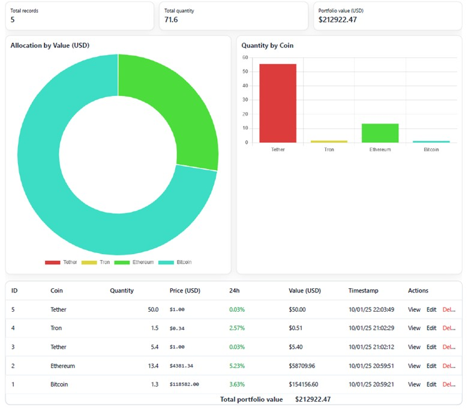

# Django Crypto Investments Dashboard
A simple Django app to track crypto holdings with live USD prices, totals, and charts — built with **Django**.
dashboard.jpg
Tutorial that I followed to start the project: https://www.youtube.com/watch?v=6gh9nypmrbg

##  Snapshot

##  Features
- CRUD for investments (Create, Read, Update, Delete)
- **Live prices** and **24h % change** via CoinGecko (with caching)
- Per-row **value** = quantity × price
- KPIs (total records, total quantity, portfolio USD value)
- Charts (Chart.js): allocation by USD value (doughnut) & quantity by coin (bar)
- Clean, business-style UI (responsive table, messages, buttons)
